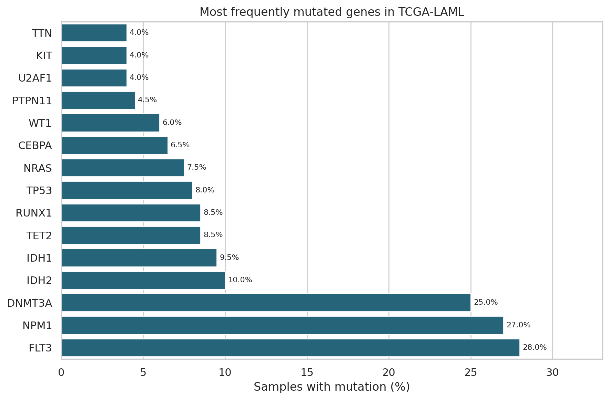

# AML Genomics & Clinical Data Explorer

A reproducible Python project exploring mutation patterns and clinical-data quality in acute myeloid leukemia (AML) using open-access, de-identified TCGA-LAML PanCancer Atlas data.

## Current milestone

Part 1 provides a transparent exploratory analysis before any machine-learning model is considered. It includes:

- Cohort and linkage integrity checks
- Clinical-data missingness assessment
- Validated somatic-mutation filtering
- Unique-sample mutation frequencies
- Variant-classification summaries
- Descriptive per-sample mutation counts
- Explicit privacy, interpretation, and modelling limitations

## Initial findings

- 200 unique patients and 200 primary samples
- 2,528 rows explicitly labelled as validated somatic mutations
- All analyzed mutation records link to the clinical sample table
- Most frequently altered genes in the validated somatic subset:
  - `FLT3`: 56 samples (28.0%)
  - `NPM1`: 54 samples (27.0%)
  - `DNMT3A`: 50 samples (25.0%)
  - `IDH2`: 20 samples (10.0%)
  - `IDH1`: 19 samples (9.5%)
- `AGE` and `SEX` are entirely missing in this cBioPortal clinical export and are not imputed



## Repository structure

```text
aml-genomics-clinical-data-explorer/
├── data/
│   ├── raw/            # Local only; never committed
│   └── processed/      # Only safe reproducible outputs when appropriate
├── notebooks/
│   └── 01_aml_data_quality_and_mutation_landscape.ipynb
├── reports/
│   ├── figures/
│   └── tables/
├── src/
├── .gitignore
├── README.md
└── requirements.txt
```

## Run locally

1. Download the public study package from cBioPortal.
2. Place these files in `data/raw/`:

```text
data_clinical_patient.txt
data_clinical_sample.txt
data_mutations.txt
```

3. Install dependencies:

```bash
pip install -r requirements.txt
```

4. Open and run the notebook from the repository root.

Raw patient-level source files are intentionally excluded from this repository.

## Data source and citation

- Study: Acute Myeloid Leukemia (TCGA, PanCancer Atlas)
- cBioPortal identifier: `laml_tcga_pan_can_atlas_2018`
- Accessed: September 1, 2026
- cBioPortal study: https://www.cbioportal.org/study/summary?id=laml_tcga_pan_can_atlas_2018
- NCI PanCancer Atlas: https://gdc.cancer.gov/about-data/publications/pancanatlas
- TCGA citation guidance: https://www.cancer.gov/ccg/research/genome-sequencing/tcga/using-tcga-data/citing

## Responsible use

Only open-access, de-identified data are used. No attempt is made to identify participants. Raw patient-level data are not published. Results are exploratory, dataset-specific, and unsuitable for diagnosis, prognosis, treatment selection, or other clinical decisions.

## Author

Saman Raftari  
Molecular genetics and clinical diagnostics professional developing skills in Python, bioinformatics, machine learning, and healthcare data analysis.
